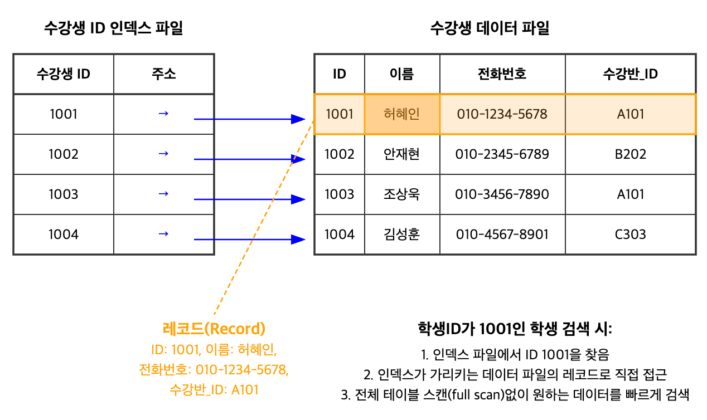

## 데이터베이스 시스템과 파일시스템의 차이점

데이터베이스 시스템의 주요 목표는 데이터를 저장하고 빠르게 접근할 수 있도록 하는 것이다.
데이터베이스 시스템은 일반 파일시스템과 달리 폴더와 파일의 계층 구조에 의존하지 않고, 구현에 특화된 형식으로 파일을 구성한다

파일시스템보다 DBMS가 좋은 측면 :

1. **저장 효율성**: 데이터 레코드당 저장 오버헤드를 최소화하는 방식으로 구성
2. **접근 효율성**: 최소한의 단계로 레코드의 위치 찾기 가능
3. **업데이트 효율성**: 레코드 갱신은 디스크 쓰기를 최소화하는 방식으로 수행

## 데이터베이스 시스템의 데이터 저장 구조

데이터베이스 시스템은 데이터 레코드를 테이블에 저장하며, 각 테이블은 일반적으로 별도의 파일로 표현된다. 테이블의 각 레코드는 검색 키를 사용하여 조회할 수 있으며 레코드의 위치는 인덱스를 사용해서 찾는다

**인덱스**
-  테이블 전체를 읽지 않고 조건을 만족하는 데이터를 빠르게 검색할 수 있는 자료구조
- 전체 필드 중 레코드를 식별할 수 있는 필드들의 부분집합을 사용해서 생성

### < 데이터 파일과 인덱스 파일 >

: 데이터베이스 시스템은 **데이터 파일**과 **인덱스 파일**을 분리해서 2가지 파일로 구성되어 있다
#### 데이터 파일
- 실제 데이터 저장 (저장소 역할)
- 전체 데이터 레코드들(필드값)을 저장하는 파일
- 간접 접근 (인덱스를 통해)
#### 인덱스 파일
- 빠른 레코드 검색 (찾아보기 역할)
- 레코드에 대한 메타데이터(위치 정보)를 저장
- 데이터 파일보다는 크기가 작음
- 인덱스를 사용하여 데이터 파일에서 레코드를 찾음
- 직접 접근
##### [ 회의실 예약 프로젝트에서의 적용 ]

데이터 파일 - 수강생의 모든 정보를 저장하는 실제 파일

인덱스 파일 - 수강생 ID를 키로 하여 데이터 파일의 레코드 위치를 가리키는 파일

> 즉, 인덱스 파일은 데이터 파일에 효율적으로 접근하기 위한 보조 구조

### < 데이터 파일의 물리적 저장 방식 >

데이터베이스의 질의 및 데이터의 용도를 고려해서 데이터 파일을 물리적 저장 장치에 데이터를 적절히 배치하고 접근해야 하는데, 데이터 파일을 어떻게 구성하고 접근 방식에 따른 **물리적 저장 방법**으로 **인덱스 구조형 테이블**, **힙 구조형 테이블**, **해시 구조형 테이블** 3가지 유형으로 구분될 수 있다

#### • 데이터 파일의 3가지 유형

| 데이터 파일 유형                             | 설명                                     | 특징                                                        |
| ------------------------------------- | -------------------------------------- | --------------------------------------------------------- |
| **인덱스 조직 테이블** (IOT)                  | 인덱스 자체에 데이터 레코드 저장 ( 인덱스 파일이 곧 데이터 파일 )  | • 레코드는 키 순서대로 저장 • 범위 스캔에 효율적 • 디스크 검색 횟수 감소        |
| **힙 조직 테이블**   | 레코드가 특별한 순서 없이 쓰기 순서대로 저장              | • 새 페이지 추가시 파일 재구성  필요 X • 검색을 위해 별도 인덱스가 필요              |
| **해시 조직 테이블**  | 레코드는 버킷에 저장 키의 해시 값에 따라 레코드가 속한 버킷 결정 | • 키를 기반으로 빠른 조회 • 버킷 내 레코드는 추가되는 순서로 저장 • 조회 향상을 위해 키 순서로 정렬 가능 |

모두 인덱스 파일을 사용하는 점은 동일하나 인덱스 파일과 데이터 파일의 분리 여부, 데이터 저장 순서 방식에 따른 차이점을 가지고 있다

- **인덱스 구성 테이블(IOT)**: 데이터 레코드가 인덱스 자체에 저장됨으로 별도의 데이터 파일이 필요 없음.
즉, 인덱스 파일이 곧 데이터 파일이므로 인덱스에서 키를 찾은 후 별도 파일을 찾을 필요가 없어 디스크 탐색이 줄어듬

- **힙 파일/해시 파일과 별도 인덱스**: 힙 파일이나 해시 파일을 사용하는 경우, 레코드는 이러한 데이터 파일에 저장. 
즉, 인덱스 파일과 데이터 파일은 분리되어 있고, 레코드를 빠르게 찾기 위해 별도의 인덱스 파일이 사용됨

##### [ 회의실 예약 프로젝트에서의 적용 ]
수강생 테이블의 빠른 조회를 위해 사용을 고려해볼 데이터 파일로 '인덱스 조직 테이블 방식'과 '해시 조직 테이블 방식'을 선택지로 고름

### < 인덱스 구성 > 

to be continue...

