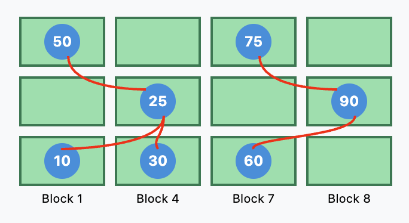

## 인메모리 스토리지 VS  디스트 기반 스토리지
앞서 1장에서 인메모리 스토리지와 디스크 기반 스토리지를 구분하였다
- **인메모리 스토리지**: 데이터를 주로 메모리에 저장하며, 어떤 주소든 물리적 거리에 상관없이 동일한 속도로 빠르게 직접 접근 가능
    
- **디스크 기반 스토리지**: 블록 단위로 접근하며, 데이터 접근시 디스트 I/O 비용이 발생
 물리적으로 가까운 데이터는 빠르게 접근가능, 멀리 있는 데이터는 디스크 헤드를 이동시켜 해서 느림
    
이러한 스토리지 특성에 따라, 각각의 스토리지 적합한 데이터베이스 자료구조가 존재하고 스토리지 환경에 따라 최적화되어야 한다

따라서 우리는 인메모리 스토리지와 디스크 기반 스토리지에 적합한 자료구조들이 각각의 매체가 가진 특성에 따라 구분되어지는 이유를 각 자료구조의 개념과 동작방식을 통해 알아보고자 한다

우선, 인메모리 스토리지에서 사용되는 자료구조를 알아보자

## 인메모리 자료구조
### 이진 탐색 트리 (BST)
> 키-값 쌍 검색에 사용되는 **정렬된 인메모리 자료구조**  : 각 트리 노드는 키, 해당 키와 연관된 값, 2개의 자식 포인터로 표현
#### 이진 탐색 트리 특징
-  모든 노드의 왼쪽 서브 트리는 해당 노드의 값보다 작은 값들만 가지고, 모든 노드의 오른쪽 서브 트리는 해당 노드의 값보다 큰 값들만 가진다
- 이진 탐색 트리의 최소값은 트리의 가장 왼쪽에 존재, 최대값은 가장 오른쪽에 존재한다
- 단 1개의 루트 노드에서 탐색을 시작하고, 자녀 노드는 최대 2개까지 가질 수 있다

  
  

#### 이진 탐색 트리의 시간복잡도

| 

       | 

최적

 | 

평균 ( ≈ 균형트리 )

 | 

최악 ( ≈ 불균형트리 )

 |
| ----------------------- | -------------------------------------------------- | ------------------------------------------------------------- | -------------------------------------------------------------- |
| 
**삽입**
 | 
O(1)
                              | 
O(logN)
                                      | 
O(N)
                                          |
| 
**삭제**
 | 
O(1)
                              | 
O(logN)
                                      | 
O(N)
                                          |
| 
**검색**
 | 
O(1)
                              | 
O(logN)
                                      | 
O(N)
                                          |

일반적으로 BST를 설명할때 '균형 트리인 경우 시간복잡도는 어떻게 될 것인가'를 분석하기 때문에, 평균 시간복잡도를 중심으로 설명하자면, 데이터 연산시 BST의 오른쪽 또는 왼쪽 서브트리 중 데이터 값에 따라 선택한 한쪽만 집중하고 다른 쪽은 신경을 쓰지 않아도 되기때문에 탐색 공간 N의 값이 절반으로 줄어든다는 사실을 알 수 있다 
##### • BST 장점 
1. **데이터 동작의 유연성** : 데이터 삽입, 삭제가 유연하다
2. **빠른 검색** : 값의 크기에 따라 좌우 서브 트리가 나눠지기 때문에 삽입/삭제/검색이 (보통은) 빠르다
3. **정렬된 데이터 저장 및 조회** : 값의 순서대로(정렬된 형태로) 순회하면서 저장 및 검색이 가능하다

##### • BST 단점
1. **불균형 트리 발생** : 불균형 트리일때 삽입, 삭제, 검색과 같은 연산들의 수행시간이 악화된다

> BST의 문제점을 해결하기 위해 **스스로 균형을 잡는** 이진 탐색 트리가 사용
>   **=> AVL 트리**
---

### AVL 트리

> 이진탐색 트리의 한 종류

#### AVL 트리 특징

- 삽입 및 삭제 시, **균형 인수(Balance Factor)** 를 사용하여 트리의 균형을 유지한다

#### 균형 유지 메커니즘 ( 트리 회전 )

- **균형 인수**: ( 노드의 왼쪽 서브트리 높이 ) - ( 오른쪽 서브트리 높이 )
    
- **회전 연산**: 균형 인수가 -1, 0 ,1 이 아닐 경우 단일 또는 이중 회전을 통해 트리의 균형을 맞춘다

---
### 탐색 트리가 디스크 기반 스토리지에 부적합한 이유

#### 1. 빈번한 재조정으로 인한 높은 트리 유지 비용
: 삽입 및 삭제 시마다 트리의 균형을 맞추기 위한 회전 연산이 필요하여 디스크 I/O 비용이 증가
#### 2. 탐색 트리의 지역성 문제
: 노드들이 키 순서에 따라 삽입되지 않고 무작위 순서로 추가될 수 있기 때문에, 부모 노드와 새로운 자식 노드가 가까운 위치에 저장되지 않고 완전히 다른 위치에 저장될 수 있다
>"부모 노드 근처에 새 노드가 작성된다는 보장이 없다"
 => 자식 노드 포인터가 여러 디스크 페이지에 걸쳐있어 디스크 I/O가 빈번하게 발생하여 성능 저하를 초래

 <h5 className="text-lg font-semibold mb-4">EX ) 노드들이 여러 디스크 블록에 분산되어 저장된 탐색 트리</h5>
 자식 노드를 접근시 다른 디스크 블록으로 이동 필요 (빨간 화살표)

#### 3. 탐색 트리의 높이 (낮은 팬아웃)
: 각 노드가 최대 두 개의 자식 노드밖에 가지지 못하므로, 트리의 높이가 증가하여 디스크 접근 횟수가 많아진다

## 디스크 기반 자료구조

### 페이지화된 이진 트리
: 페이지화된 이진 트리는 여러 노드를 하나의 디스크 페이지에 저장하여 지역성을 향상시키는 방법
관련된 노드들(예: 부모와 일부 자식들)을 같은 디스크 블록(페이지)에 그룹화하여 이진 트리를 배치하면 다음 노드를 찾기 위해서는 이미 가져온 페이지에서 포인터를 따르기만 하면 된다

- 한계점
: 여전히 일부 노드 포인터는 다른 페이지를 가리킬 수 있어 페이지 간 이동이 필요 -> 포인터로 인한 오버헤드가 여전히 존재 

##### EX) 페이지 이진 트리

  
  

  디스크 접근 횟수가 줄어들지만, 여전히 블록 간 포인터(빨간색)가 필요

## 그럼 자식을 많이 가지는 탐색 트리를 만들면 되겠네? 
결과적으로, 디스크 기반 저장에 적합한 자료구조는 다음과 같은 특성을 갖춰야함을 알았다

- 높은 팬아웃 : 각 노드가 더 많은 키와 자식 노드를 보유하여 인접 키의 지역성을 높임
- 낮은 트리 높이 : 트리 순회 중 디스크 탐색 횟수를 최소화

이런 특성을 갖추면서 이진 탐색 트리의 장점(로그 시간 검색)을 유지하는 자료구조로 B-트리가 등장했다
### B-트리

#### B-트리 특징
- 한 노드에 여러 키 저장: 각 노드가 여러 키와 자식 포인터를 포함하여 디스크 블록 크기를 최대한 활용한다
- 더 낮은 트리 높이(높은 팬아웃): 각 노드가 다수의 자식 노드를 가짐으로써 높은 팬아웃으로 트리 높이가 줄어든다
- 일관된 블록 크기: 노드 크기를 디스크 블록 크기에 맞춰 최적화되어 1번의 디스크 I/O로 여러개의 키를 읽을 수 있다 

 <h5 className="text-lg font-semibold mb-4">EX ) B-트리</h5>