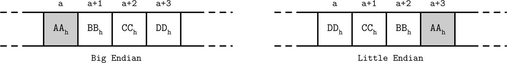
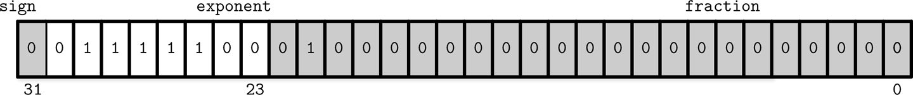

## B-트리 검색 알고리즘


### 검색(조회) 과정의 기본 원리


### 키 개수 


### B-트리 노드 분할


### B-트리 노드 병합


# CH3. 파일 포맷

3장은 B-트리를 포함한 다른 자료구조들이 디스크에서 어떻게 구현되는지, 디스크에 올릴때 어디에 저장되는지에 대해 살펴본다
<br>먼저 메모리 접근 방식과 디스크에 접근하는 방식의 **근본적인 차이**를 이해해야한다

## 디스크 접근과 메모리 접근의 근본적 차이

### 메모리 접근 방식

#### 1. 메모리 접근은 투명하다 ?

-  애플리케이션 개발자가 **'어디에'** 메모리가 실제로 놓여 있는지를 신경 쓰지 않고, 변수나 포인터를 통해 마치 연속된 공간인 것처럼 자유롭게 읽고 쓸 수 있다는 의미

 ##### 투명성의 핵심 요소 : 
   - 프로그래머가 메모리 할당(`malloc`, `new` 등)을 호출하면 운영체제가 실제 물리 메모리 관리를 담당
   - 포인터를 역참조할 때 가상 메모리에서 물리 메모리로의 변환이 하드웨어(MMU)와 OS에 의해 자동으로 처리
   - 메모리 페이지 부재(page fault)가 발생하더라도 OS가 디스크에서 메모리로 페이지를 자동 로드

   이런 투명성 덕분에 프로그래머는 복잡한 메모리 관리를 신경 쓰지 않고 자료구조와 알고리즘에 집중할 수 있다

#### 2. 가상 메모리를 사용해 오프셋을 직접 관리하지 않아도 된다


> **가상메모리 ?** 
> <br> : 프로세스에 연속적인 메모리 주소 공간을 제공하는 추상화 계층
> <br>OS가 각 프로세스에 가상 주소 공간을 할당하고,개발자는 0x1000, 0x1004 같은 가상 주소만 사용한다.
> <br>( 이 주소가 실제 물리 메모리의 어느 위치에 대응되는지는 OS·MMU(Memory Management Unit)가 처리 )

        
즉, 개발자는 주소를 단순히 읽고 쓰면 되고, "몇 바이트 떨어진 위치"를 직접 계산할 일이 없다

### 디스크 접근 방식

#### 1. 디스크 접근은 시스템 호출을 통해 이루어진다

   - 파일 열기(`open`), 읽기(`read`), 쓰기(`write`), 위치 지정(`seek`) 등 명시적 호출 필요

#### 2. 오프셋 관리 필요
   - 파일 내 위치를 직접지정해야 함
   - 데이터 구조의 일부분만 접근하더라도 파일 내 정확한 위치 계산 필요

#### 3. 직렬화/역직렬화 필요
   - 디스크에서 데이터를 읽은 후 메모리 내 자료구조로 변환하는 과정과 메모리 내 자료구조를 디스크에 저장 가능한 형태로 변환하는 과정 필요

이런 차이점을 감안해서 디스크 위에 자료구조를 올릴 때는 **“어디에, 어떻게”** 저장할지를 직접 설계하는 **파일 포맷** 과정이 중요하다

## 파일 포맷 설계의 중요성
파일 포맷 설계는 비관리형 메모리 모델을 사용하는 언어(예: C)에서 자료 구조를 구현하는 것과 유사한 점이 있지만, 디스크의 특성으로 인해 더 많은 제약과 고려사항이 존재한다

- 메모리에서는 `malloc`과 `free`를 통해 필요한 만큼 메모리를 할당하고 해제할 수 있지만, 디스크에서는 단편화, 가비지 컬렉션 등을 직접 관리해야 함
- 메모리에서는 포인터를 통해 쉽게 데이터를 참조할 수 있지만, 디스크에서는 오프셋 계산과 관리가 필요함
- 메모리에서는 가변 길이 데이터 처리가 상대적으로 간단하지만, 디스크에서는 특별한 레이아웃과 처리 방식이 필요함


## 바이너리 인코딩

#### 참고 ) 바이너리 인코딩 vs 텍스트 인코딩

디스크에 데이터를 저장할 때 2가지 접근 방식
1. **텍스트 인코딩**:
   - 사람이 읽을 수 있는 형식(예: JSON, XML)
   - 디버깅 용이, 수동 편집 가능
   - 공간 효율성이 떨어지고 파싱 비용이 높음

2. **바이너리 인코딩**:
   - 컴퓨터가 직접 처리하기 위한 형식
   - 공간 효율적이고 빠른 처리 가능
   - 디버깅이 어렵고 직접 편집 불가

데이터를 효율적으로 디스크에 저장하려면 직렬화와 역직렬화가 쉬운 포맷으로 저장해야한다
<br>따라서, 데이터베이스 시스템은 성능을 위해 주로 바이너리 인코딩을 사용한다
### 바이너리 인코딩의 기본 구성 요소


#### 1. 기본형 (Primitive Types)

바이너리 인코딩의 기본 구성 요소는 고정 크기를 가진 기본형 데이터 타입이다
<br> 기본형 데이터 타입를 바이너리 형식으로 표현하는 방법은 다음과 같다

- **정수형(Integer Types)**
    
    - 정수형의 고정 길이는 다양하다
    :  byte(8비트), short(16비트), int(32비트), long(64비트) 등
    - 멀티바이트 정수형 값을 사용할때 인코딩과 디코딩은 모두 같은 **바이트 순서**를 사용해야한다

    `바이트 배열 순서(엔디안)의 중요성`

    멀티바이트 값을 저장할 때 **바이트 순서(Endianness)** 는 중요한 개념으로 2가지로 구분된다

    - **빅 엔디안(Big-endian)**: 최상위 바이트(MSB)부터 내림차순으로 저장
    - **리틀 엔디안(Little-endian)**: 최하위 바이트(LSB)부터 오름차순 저장

    예를 들어, 16진수 32비트 정수 '0xAABBCCDD'를 빅 엔디안과 리틀 엔디언 방식으로 저장하면 다음과 같이 저장된다 (회색 박스 AA가 MSB)
    <center></center>

    
    <br>이는 단순히 구현 선택의 문제가 아니라, **플랫폼 간 호환성**에 직접적인 영향을 미친다. 데이터를 한 시스템에서 다른 시스템으로 이동할 때 바이트 순서가 다르면 값이 완전히 달라질 수 있기 때문이다. 따라서 데이터를 저장하고 불러올 때는 일관된 바이트 순서를 사용해야 한다.

  
- **부동소수점(Floating-Point)**
    
    부동소수점은 부호(sign), 가수(fraction), 지수(exponent)로 구성된다
    - **32비트 float**
    
        예를 들어 0.15652라는 값은 비트로 변환했을 때, 첫 23비트가 가수, 다음 8비트가 지수, 마지막 1비트가 부호를 나타낸다
         <center></center>

    - **64비트 double**
        
        double은 double-precision 부동소수점으로, 비트 구성은 보통 부호 1비트, 지수 11비트, 가수 52비트로 구


#### 2. 문자열과 가변 크기 데이터

고정 크기를 가지는 기본형 데이터와 달리, 문자열과 같은 가변 크기 데이터는 2가지 처리 방식을 가진다

- #### Pascal 문자열
    데이터(배열,문자열) 길이를 저장한 후 실제 데이터를 저장하는 방식

    ```
    struct String {
        size unit_16;     // 문자열 길이 필드
        data byte[size];  // 가변 길이 데이터
    }
    ```

     장점 :
    - 문자열 전체를 확인하지 않고 길이를 상수시간 O(1) 시간에 알 수 있음

- #### Null 종료 문자열
    파스칼 문자열의 대안으로 나온 방식으로, C 언어의 문자열처럼 종료 문자(보통 '\0')에 도달할 때까지 문자열을 읽는 방식

<br>Null 종료 문자열은 길이를 알기 위해 전체 문자열을 확인해야하기 때문에 데이터베이스 시스템은 일반적으로 파스칼 문자열 방식을 선호한다

#### 3. Bit-Packed 데이터 : 불리언, 열거형, 플래그

메모리와 디스크 공간을 절약하기 위해 여러 작은 값들을 한 바이트 내에 묶는 기법이라고 생각하면 된다

- #### 불리언 자료형의 Bit-Packed 방식
    불리언 값은 실제로 1비트만 필요하지만, 대부분의 언어에서는 최소 1바이트를 사용하기 때문에 공간 낭비를 방지하고자 8개의 불리언 값을 하나의 비트로 묶어서 쓰는 방식이다

- #### 열거형(Enum)과 플래그(Flags)
    적은 수의 상태 값을 표현할 때는 열거형(Enum)을 사용할 수 있는데, 다음과 같이 B-트리 노드의 종류 표현에도 사용할 수 있다

    ```
    enum NodeType {
    ROOT,        // 0x00h (루트 노드)
    INTERNAL,    // 0x01h (내부 노드)
    LEAF         // 0x02h (리프 노드)
    };
    ```

    여러 상태를 동시에 표현해야 할 때는 플래그를 사용한다

   
