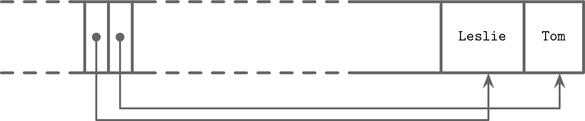

파일 포맷 설계는 크게 **아래의 과정**을 거친다

1. **주소 지정 방식 결정**
2. **전체 파일 구조 설계**
3. **스키마 설계**
4. **세부 데이터 레이아웃**

이러한 설계 흐름을 따라가며, 각 단계에서 고려해야 할 핵심 개념들과 설계 원칙들을 자세히 살펴보자


## 주소 지정 방식 결정

### 페이지 구성 방식의 두 가지 접근법

파일 포맷 설계의 첫 번째 단계는 **주소 지정 방식을 결정**하는 것이다
</br>이는 파일을 어떤 단위로 나누어 관리할 것인지를 결정하는 중요한 선택으로, 크게 두 가지 방식이 있다

#### 1. 단일 블록 페이지 방식
:  하나의 페이지가 정확히 하나의 디스크 블록에 대응
-  페이지 크기 = 디스크 블록 크기 
-  주소 계산이 매우 간단 (페이지 번호 × 페이지 크기 = 실제 위치)

#### 2. 다중 블록 페이지 방식

: 하나의 페이지가 여러 개의 연속된 디스크 블록으로 구성
-  페이지 크기 > 디스크 블록 크기 (예: 16KB 페이지 = 4개의 4KB 블록)
-  더 큰 단위로 데이터를 읽어서 순차 읽기 성능 향상

### 저장소 업데이트 방식과의 연관성

주소 지정 방식의 선택은 새로운 레코드를 추가하는 저장소의 **업데이트 전략**과 밀접한 관련이 있다

#### In-Place Update (제자리 업데이트) 방식
: 기존 데이터를 직접 수정하는 방식
<center></center>

- **모든 페이지가 동일한 크기**여야 하는데, 동일한 크기의 페이지를 사용해야 주소 계산이 간단해지고 읽기와 쓰기 접근을 크게 단순화할 수 있어서 특정 위치의 데이터를 바로 찾아서 수정할 수 있기 때문
- 주로 B-Tree, 관계형 데이터베이스 사용됨


#### Append-Only (추가 전용) 방식

: 항상 파일 끝에 새 데이터 추가
<center></center>

- 페이지별로 크기가 달라도 됨
- 메모리에서 페이지 단위로 데이터를 모았다가, 페이지가 가득 차면 한 번에 디스크로 flush함
- LSM Tree, 로그 파일, NoSQL 시스템에 주로 사용


## 전체 파일 구조 설계

### 기본 파일 구조 vs 데이터베이스 파일 구조

#### 기본 파일 구조

```
┌─────────────┐
│   Header    │ ← 고정 크기, 메타데이터
├─────────────┤
│   Page 1    │ ← 동일한 크기
├─────────────┤
│   Page 2    │ ← 동일한 크기  
├─────────────┤
│     ...     │
├─────────────┤
│   Page N    │ ← 동일한 크기
├─────────────┤
│   Trailer   │ ← 고정 크기, 체크섬 등
└─────────────┘
```

#### 데이터베이스 파일 구조

```
┌─────────────────────────────┐
│   Header + Lookup Table     │ ← 룩업 테이블 추가
├─────────────────────────────┤
│   Employee Data Section     │ ← 다양한 크기 가능
├─────────────────────────────┤
│   Department Data Section   │ ← 다양한 크기 가능
├─────────────────────────────┤
│   Index Data Section        │ ← 다양한 크기 가능
├─────────────────────────────┤
│   Log Data Section          │ ← 다양한 크기 가능
├─────────────────────────────┤
│          Trailer            │
└─────────────────────────────┘
```

### 룩업 테이블(Lookup Table) ?

데이터베이스 파일 구조와 기본 파일 구조에서 가장 차이가 보이는 점은 **헤더에 포함된 룩업 테이블**이다.
룩업 테이블은 책의 목차와 같이 원하는 내용이 몇 페이지에 있는지 목차를 보고 바로 찾아갈 수 있는 역할을 한다 

- 파일 내 각 섹션의 시작 위치와 크기 정보를 기록한 "목차"
- 원하는 데이터 섹션을 빠르게 찾아갈 수 있는 네비게이션 도구
- 파일 헤더, 트레일러, 또는 별도 파일에 저장

#### 룩업 테이블 예시

```
Lookup Table in File Header:
┌─────────────────────────────────────┐
│ Employee_Data    → Offset: 1024     │
│ Department_Data  → Offset: 51024    │  
│ Index_Data       → Offset: 61024    │
│ Log_Data         → Offset: 86024    │
└─────────────────────────────────────┘
```

#### 룩업 테이블의 장점

- **O(1) 접근**: 원하는 섹션으로 바로 점프 가능
- **효율성**: 전체 파일을 스캔할 필요 없음
- **확장성**: 새로운 섹션 추가가 용이
- **유지보수성**: 각 섹션을 독립적으로 관리 가능

---

## 스키마 설계

### 고정 스키마(Fixed Schema)

파일 구조를 설계했다면, **실제 데이터를 어떻게 저장할 것인지**에 대한 스키마를 설계도 고려해봐야한다
#### 고정 스키마란?

: 테이블의 필드 개수, 순서, 타입을 미리 정의해 놓은 구조
- 모든 레코드가 동일한 구조를 가짐
- 필드명을 반복 저장하지 않아 디스크 공간을 절약하고, 위치 기반 접근으로 빠른 데이터 액세스가 가능함

    ```
    // 스키마 없이 저장할 경우
    "name:John,birth:1990-01-01,tax:123456,gender:M"
    "name:Sarah,birth:1985-05-15,tax:789012,gender:F"
    → 필드명(name, birth, tax, gender)을 매번 반복 저장

    // 고정 스키마로 저장할 경우
    스키마: [employee_id, tax_number, birth_date, gender, first_name, last_name]
    레코드 1: [1, 123456, 1990-01-01, M, "John", "Doe"]  
    레코드 2: [2, 789012, 1985-05-15, F, "Sarah", "Smith"]
    → 필드명 없이 위치(position)로만 저장
    ```

### 가변 길이 필드 처리 전략

실제 데이터베이스에서는 문자열과 같은 **가변 길이 필드**를 효율적으로 처리해야하는데
책에서는 

#### 책의 예시: 회사 직원 정보 저장

```
고정 길이 필드들 (Fixed-size fields):
┌─────────────────────────────────────────────────────┐
│ employee_id (4 bytes) │ tax_number (4 bytes)        │
│ birth_date (3 bytes)  │ gender (1 byte)             │  
│ first_name_length (2) │ last_name_length (2)        │
└─────────────────────────────────────────────────────┘
총 16 bytes

가변 길이 필드들 (Variable-size fields):
┌─────────────────────────────────────────┐
│ first_name (first_name_length bytes)    │
│ last_name (last_name_length bytes)      │
└─────────────────────────────────────────┘
```

### 가변 길이 필드 접근 방식 비교

#### 방법 1: 길이 계산 방식

```
first_name 접근: 고정영역(16) + 0 = 16번째 위치
last_name 접근: 고정영역(16) + first_name_length(4) = 20번째 위치
```

**문제점**: last_name에 접근하려면 앞의 모든 가변 필드 길이를 계산해야 함

#### 방법 2: 오프셋 저장 방식 

```
고정 영역에 미리 저장:
┌─────────────────────────────────────────────────────┐
│ employee_id (4)    │ tax_number (4)                 │
│ birth_date (3)     │ gender (1)                     │
│ first_name_offset  │ first_name_length              │
│ last_name_offset   │ last_name_length               │
└─────────────────────────────────────────────────────┘

실제 사용:
- first_name: offset=16, length=4 → 위치 16에서 4바이트 읽기
- last_name: offset=20, length=3 → 위치 20에서 3바이트 읽기
```

#### 오프셋 저장 방식의 장점

- **직접 접근**: 계산 없이 바로 해당 위치로 점프
- **성능**: O(1) 접근 시간 보장
- **확장성**: 필드 개수가 늘어나도 성능 저하 없음
- **유지보수성**: 각 필드를 독립적으로 접근 가능

### 계층 구조

실제 데이터베이스 시스템에서는 **복잡한 계층 구조**가 필요하다

#### 계층 구조의 형태

```
Primitives (기본 타입)
    ↓
Fields (필드) - int, string, date로 구성된 필드들
    ↓  
Cells (셀) - 여러 필드로 구성된 완전한 레코드
    ↓
Pages (페이지) - 여러 셀들을 모은 페이지
    ↓
Sections (섹션) - 여러 페이지들을 모은 섹션  
    ↓
Regions (리전) - 여러 섹션들을 모은 리전
```

# 세부 데이터 레이아웃

데이터 구조의 계층에서 보았듯이, 기본 타입으로 구성된 필드들로 의미있는 데이터의 최소단위인 '셀' 레이아웃을 설계할 수 있다
```
기본 타입 → 셀 (Cell) → 슬롯 페이지 → B-Tree
```

## 셀 구조
셀은 '키 셀'과 '키-값 셀'로 나눌 수 있다

### Key Cell (키 셀)

**용도**: B-Tree 내부 노드에서 사용
- 구분키 저장
- 자식 페이지 포인터 저장
- 검색 경로 안내

```
// 가변 길이 키 셀
┌─────────────┬──────────────┬─────────────────┐
│  key_size   │   page_id    │   key bytes     │
│  (4 bytes)  │  (4 bytes)   │   (가변 길이)   │
└─────────────┴──────────────┴─────────────────┘
     0-4           4-8            8-...
```

### Key-Value Cell (키-값 셀)

**용도**: B-Tree 리프 노드에서 사용
- 실제 데이터 레코드 저장
- 키와 값을 함께 보관
- 최종 데이터 접근점

```
┌──────────┬─────────────┬──────────────┬─────────────┬──────────────┐
│  flags   │  key_size   │  value_size  │ key bytes   │ value bytes  │
│ (1 byte) │ (4 bytes)   │  (4 bytes)   │ (가변 길이) │  (가변 길이) │
└──────────┴─────────────┴──────────────┴─────────────┴──────────────┘
    0-1        1-5           5-9           9-...        ...-...
```

### 셀 설계의 핵심 원칙

####  고정 길이 필드 앞쪽에 저장
> "We have grouped fixed-size data fields together"

오프셋 계산을 단순화하기 위해 고정 길이 필드를 앞쪽에 저장

#### 셀의 메타데이터의 페이지 레벨 저장
> "We can store metadata describing cells once on the page level"

셀에 관한 정보를 각 셀마다 중복 저장하지 않고 페이지 레벨에서 한 번만 저장


## 가변 길이 데이터 관리

### 가변 길이 데이터 접근 방법

```
Key-Value Cell의 데이터 접근:

1. Key 위치 찾기:
   - Header(9 bytes) 건너뛰기
   - key_size만큼 읽기

2. Value 위치 찾기:  
   - Header(9 bytes) + key_size 건너뛰기
   - value_size만큼 읽기

예시:
Header(9) + Key("employee_123", 12) + Value("John Doe Data", 13)
→ Key: 9~21 위치, Value: 21~34 위치
```
---

## 셀들의 집합: 페이지 구조

### 왜 슬롯 페이지가 필요한가?

#### 기존 B-Tree 페이지의 문제점

```
기존 방식: [Key-Value-Pointer-Key-Value-Pointer...]

문제점:
1. 중간에 키 삽입 시 → 전체 요소 재배치 필요
2. 가변 길이 레코드 → 효율적 관리 어려움  
3. 삭제된 공간 → 재활용 복잡
```

#### 슬롯 페이지의 해결책

> **"포인터와 셀을 분리하여 두 개의 독립적인 메모리 영역에 배치"**

---

## 슬롯 페이지
: 가변 길이 레코드의 완벽한 해결책


### 슬롯 페이지가 해결하는 3가지 문제

#### 최소 오버헤드로 가변 길이 레코드 저장
> **"Minimal overhead: the only overhead incurred by slotted pages is a pointer array"**

슬롯 페이지의 유일한 오버헤드는 레코드가 저장된 정확한 위치를 가리키는 포인터 배열뿐

#### 삭제된 레코드 공간 재활용
> **"Space reclamation: space can be reclaimed by defragmenting and rewriting the page"**

공간을 조각 모음하고 페이지를 다시 작성하여 공간을 재활용할 수 있음

#### 위치에 관계없는 레코드 참조
> **"Dynamic layout: from outside the page, slots are referenced only by their IDs"**

페이지 외부에서는 슬롯 ID로만 레코드를 참조하므로, 정확한 위치는 페이지 내부에서만 관리됨

## 슬롯 페이지의 실제 동작

### 셀 병합으로 슬롯 페이지 구성

슬롯 페이지에서는 **셀을 페이지 오른쪽에 추가**하고, **셀 오프셋/포인터를 페이지 왼쪽에 추가**함


**셀 데이터**: 삽입 순서대로 물리적 저장

**슬롯 포인터**: 키 순서대로 논리적 정렬
<center></center>

#### 책 예시: 이름 저장 페이지

**• 초기 데이터 삽입**

삽입 순서: `Tom` → `Leslie`
<center></center>

레코드 삽입 후 논리적 순서: `Leslie, Tom`

레코드 사입 후 물리적 순서: `Tom, Leslie`


**• 새로운 레코드 추가**

새 이름 추가: `Ron`
<center></center>

삽입 후 논리적 순서: `Leslie` → `Ron` → `Tom`


새 데이터는 페이지의 자유 공간 상단 경계에 추가되지만, 셀 오프셋은 사전식 키 순서를 유지해야 합니다.

### 데이터 삽입 과정

```
1. 새로운 셀 생성:
   Key-Value Cell: [flags][key_size][value_size][key][value]

2. 페이지 오른쪽에서 셀 데이터 저장:
   Page[end] ← 새로운 셀 데이터

3. 페이지 왼쪽에 슬롯 포인터 추가:
   Slot[n] ← 새로운 셀의 오프셋

4. 페이지 헤더의 슬롯 카운트 업데이트
```

### 데이터 삭제 과정

```
1. 슬롯 포인터 무효화:
   Slot[n] ← NULL 또는 제거

2. 실제 셀 데이터는 그대로 유지:
   - 즉시 삭제하지 않음
   - 가용 공간 리스트에 추가

3. 필요시 Defragmentation:
   - 살아있는 셀들만 재배치
   - 빈 공간 완전히 회수
```


## 페이지에서 B-Tree로

### 슬롯 페이지 → B-Tree 구성

> **"then combine cells into pages, and compose a tree out of the pages"**

**계층적 구성:**

1. **셀(Cell)**: 기본 데이터 저장 단위
2. **슬롯 페이지**: 여러 셀들을 효율적으로 관리
3. **B-Tree 노드**: 슬롯 페이지 = B-Tree 노드
4. **B-Tree**: 여러 노드들의 계층적 구조

---

